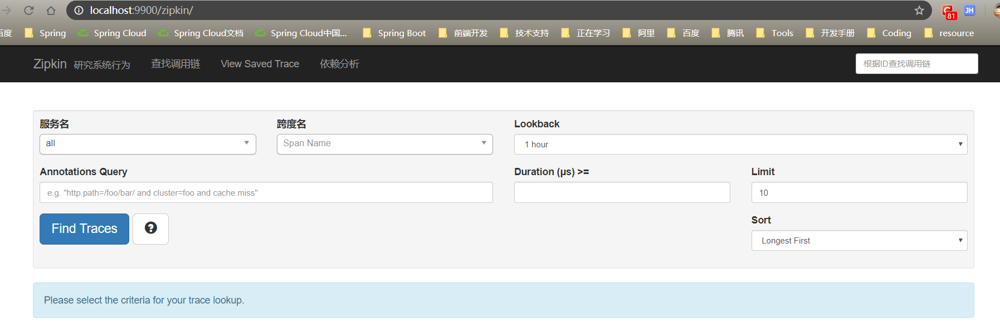
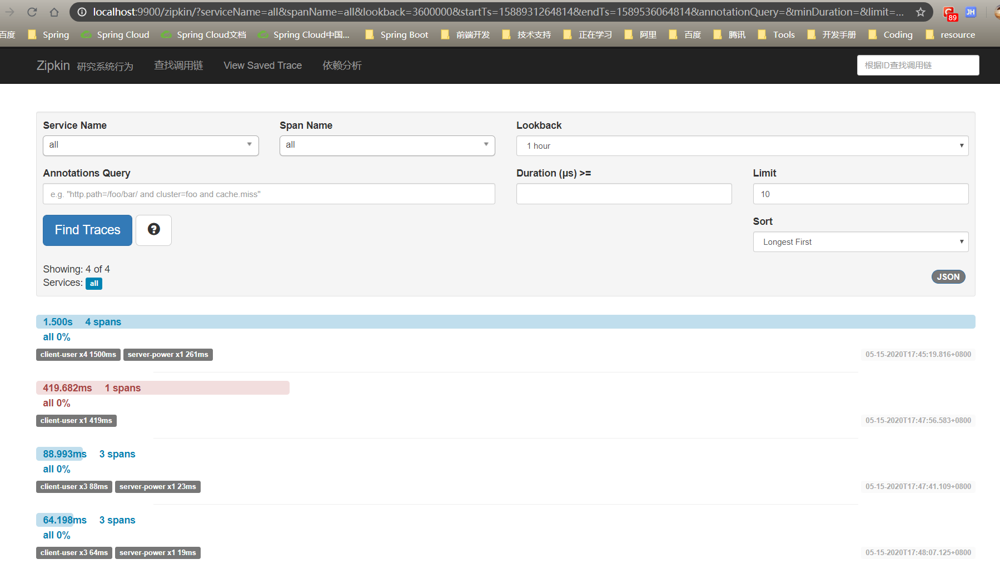
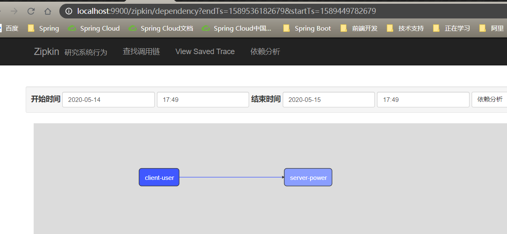

## Spring Cloud Sleuth

spring cloud zipkin （ Sleuth ）服务链路追踪

> ​        引用：微服务架构是一个分布式架构，微服务系统按业务划分服务单元， 一个微服务系统往往有 很多个服务单元。由于服务单元数量众多，业务的复杂性较高，如果出现了错误和异常，很难 去定位。主要体现在一个请求可能需要调用很多个服务，而内部服务的调用复杂性决定了问题 难以定位。所以在微服务架构中，必须实现分布式链路追踪， 去跟进一个请求到底有哪些服务 参与，参与的顺序又是怎样的，从而达到每个请求的步骤清晰可见，出了问题能够快速定位的目的


​		`springcloud Greenwich.RELEASE`取消了 `zipkin`依赖信息，推荐重官方下载Sleuth服务 ，官当地址为
https://dl.bintray.com/openzipkin/maven/io/zipkin/java/zipkin-server/

但这里我们手动搭建Sleuth服务

### 服务端搭建

`pom.xml`

```xml
<dependency>
    <groupId>io.zipkin.java</groupId>
    <artifactId>zipkin-autoconfigure-ui</artifactId>
    <version>2.8.4</version>
</dependency>
<dependency>
    <groupId>io.zipkin.java</groupId>
    <artifactId>zipkin-server</artifactId>
    <version>2.8.4</version>
    <!--排除 zipkin-server 中依赖的 SLF4j-->
    <exclusions>
        <exclusion>
            <groupId>org.apache.logging.log4j</groupId>
            <artifactId>log4j-slf4j-impl</artifactId>
        </exclusion>
    </exclusions>
</dependency>
```

`application.yml`

```yaml
server:
    port: 9900


#解决IllegalArgumentException: Prometheus requires that all meters with the same name have the same set of tag keys.
management:
    metrics:
        web:
            server:
                autoTimeRequests: false

## 解决could not be registered.
spring:
    main:
        allow-bean-definition-overriding: true
    application:
        name: spring-cloud-zipkin


#zipkin:
#    storage:
#        type: elasticsearch
#        elasticsearch:
#            cluster: elasticsearch
#            hosts: http://localhost:9200
#            index: zipkin
eureka:
    client:
        service-url:
            defaultZone: http://localhost:3000/eureka

```

`App` 添加相关注解，启动服务；

```java
@SpringBootApplication
@EnableEurekaClient
@EnableZipkinServer
public class AppZipkinServer {
    public static void main(String[] args){
        SpringApplication.run(AppZipkinServer.class);
    }
}
```

启动后，访问http://localhost:9900/zipkin/



​		这是用来查询分布式链路数据的页面，这里列出了查询条件，从第一行开始从左到右分别是：微服务名称（就是你配置文件里面的application name）， span（即上文所解释的）名称，时间段，自定义查询条件，一次调用链的持续时间，一页数量，排序规则目前来讲，我们肯定是查询不到数据的，我们把我们自己的微服务和 sleuth整合并把数据上传到`zipkin server`

### 客户端使用

**sleuth微服务整合Zipkin**

`pom.xml`依赖

```xml
<!--分布式链路跟踪-->
<dependency>
    <groupId>org.springframework.cloud</groupId>
    <artifactId>spring-cloud-starter-sleuth</artifactId>
</dependency>
<dependency>
    <groupId>org.springframework.cloud</groupId>
    <artifactId>spring-cloud-starter-zipkin</artifactId>
</dependency>
```

在需要使用zikpin的微服务中添加下面配置

```yaml
spring:
    application:
        name: client-user #此实例注册到eureka服务端的name
    zipkin:
        base-url: http://localhost:9900  #指定Zipkin server地址
    sleuth:
        sampler:
           probability: 1.0  #request采样的数量的标准 默认是0.1 也即是10%  
                             #顾名思义 采取10%的请求数据  因为在分布式系统中，
                             #数据量可能会非常大，因此采样非常重要。我们示例数据少最好配置为1全采样
```

zipkin trace



利用zipkin依赖分析




### 使用ElasticSearch 做数据持久化

